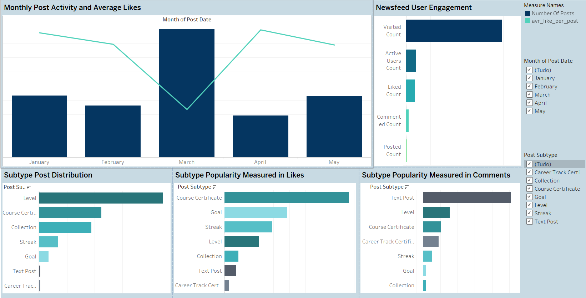

# Newsfeed Analysis in Tableau

## Project Overview
This project focuses on analyzing the user engagement patterns of the 365 platform’s newsfeed feature using Tableau. The newsfeed combines automated posts showcasing milestones (e.g., certificates, goals, streaks) and manual posts (text entries by users). The goal was to identify which post types resonate more with users and recommend strategies to optimize engagement.

## Objective
The main objective was to create a Tableau dashboard to visualize and analyze:
- User interactions with the newsfeed from January 1, 2023, to May 31, 2023.
- Engagement trends across different post subtypes (e.g., likes, comments, post counts).
- The overall user activity and engagement with the newsfeed feature.

## Problem Statement
The newsfeed is a critical feature for driving user engagement, fostering community interactions, and influencing subscription renewals. However, the platform lacked clarity on:
- Which post types (automated vs. manual) performed better in terms of user engagement.
- Seasonal trends in newsfeed activity.
- User behavior in terms of visiting, liking, commenting, or creating content.

## What Was Done
### Data Analysis and Visualization
1. **Dual Chart**:
   - Created a bar and line chart showing the monthly post count and average likes per post.
   - Analyzed trends and seasonality in post popularity.

2. **Subtype Analysis**:
   - Built three bar charts ranking post subtypes by:
     - Total number of posts.
     - Total likes received.
     - Total comments generated.
   - Identified the most engaging post types.

3. **User Activity Breakdown**:
   - Created a bar chart showing user activity:
     - Newsfeed visitors.
     - Active users engaging through likes, comments, or posts.
   - Demonstrated engagement levels and proportions of active users.

### Dashboard Features
- Added filters for:
  - Time range: To focus on specific periods.
  - Post subtype: To explore specific content types.
- Ensured user activity breakdown was not affected by filters for an overall engagement view.

     
   *Figure: Dashboard*

## Key Insights
- **Engagement Trends**: Certain months exhibited higher post activity and likes, suggesting seasonal patterns.
- **Post Subtype Performance**: Automated posts like course certificates and goals garnered high likes, while manual text posts received the most comments.
- **User Interaction Levels**: A significant portion of users visited the newsfeed, but only a subset actively engaged with posts.

## Conclusions
The analysis revealed critical insights into user engagement:
- Automated posts drive likes, while manual text posts foster discussions.
- Seasonal trends indicate periods of high engagement, helping to optimize content release strategies.
- Recommendations include encouraging manual posts to boost discussions and tailoring automated content to maximize user interest.

## Future Improvements
- Incorporate demographic and behavioral data to personalize the newsfeed experience.
- Utilize predictive analytics to recommend content types based on user preferences.